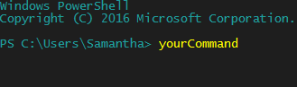

# How to PowerShell Profile
Using the PowerShell profile, you can make simple functions quickly and easily. These can be entered directly into PowerShell:



### Set up profile
1. Test if you have a profile (type into PowerShell):

```Test-path $profile
```
2. If it says **false**, type (else skip to #3):

```New-item –type file –force $profile
```
3. Then edit your profile (can be any text editor, notepad is easy though):

```Notepad $profile
```
4. In your profile doc, type your desired "mini-script" in the form of:

```
function yourFunction {
        //regular shell commands go here. ex:
        git fetch
        git pull
        git add .
        git commit -m "don't hard code this"
}
```

### Execute Command
1. By default, PowerShell will NOT run scripts (that aren't built in) unless it is administratively instructed to do so. To override this, start PS as admin and be like:

```Set-ExecutionPolicy RemoteSigned
```
2. Say yes when it prompts you and reload PS when it's done.
3. Type your function name in as though it were a built in command and watch!
---
Check my attached profile if you'd like an example. PS, the last instruction in that profile checks if PowerShell is in admin mode and turns the text red if it is. There are lots of little mini-script things online that you can copy paste.
